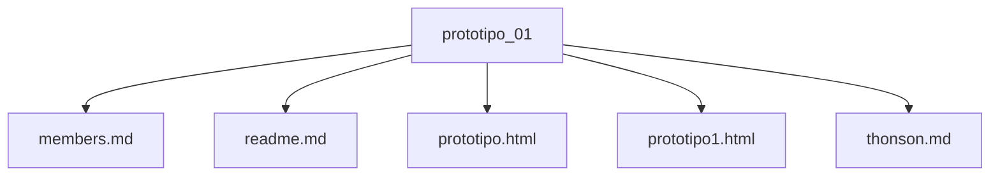

# 📘 Trabajo: Prototipo 01 – Gestión de Repositorio y Colaboración

## Universidad Compensar
**Asignatura:** levantamiento de requerimientos  
**Docente:** Cristhian Fernando Moreno  
**Fecha:** 29/08/2025  

---

## 👥 Integrantes
Cada integrante debe registrarse con:  
- Santiago Mendoza Villanueva, Samuel Mican     
- smendozav@ucompensar.edu.co     
  
---

## 📌 Introducción
Este repositorio corresponde al trabajo de Prototipo 01.  
Aquí se evidenciará el uso de GitHub con colaboración en equipo, manejo de ramas, commits y pull requests.  

---

## ⚙️ Estructura del repositorio
```
prototipo_01/
│── members.md
│── thonson.md
│── readme.md
│── prototipo.html
│── prototipo1.html
```

---

## 📊 Diagrama Mermaid

